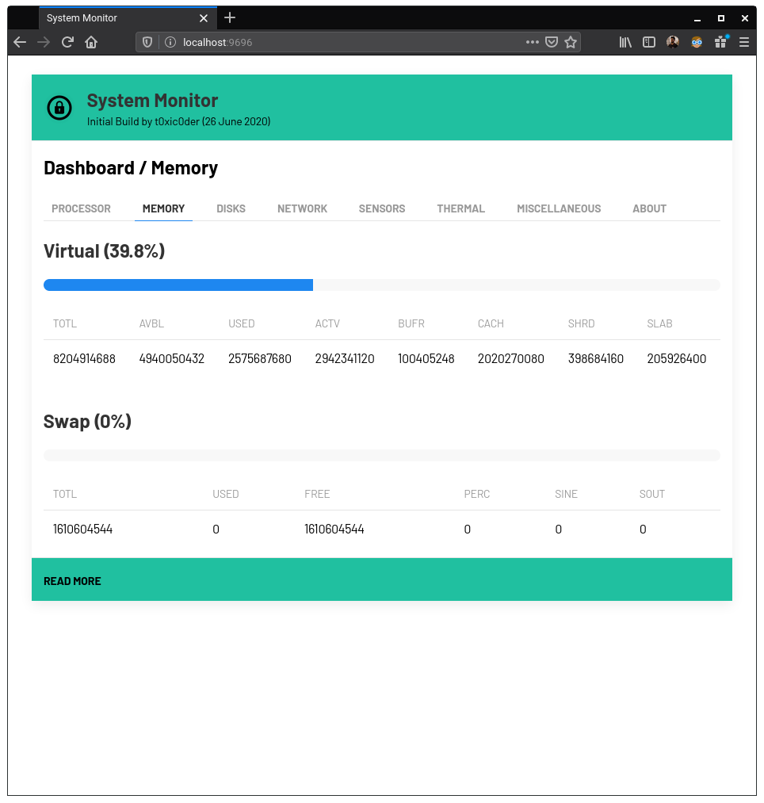

# sysmon
An intuitive system performance monitoring tool

## Features
- Simplistic implementation of asynchronous periodic AJAX calls to fetch information
- Relatively low overhead from the server during stat (approx. 4MB over runtime usage)
- Easy and flexible customization of interface by replacing the assets with your own
- Tweakable refresh times for dynamic information with endpoints powered by `psutil`

## Usage
1.  Install and upgrade virtualenv if not already done by executing `pip3 install virtualenv --user`
2.  Clone the repository on your local drive and make it your current working directory
3.  Create a virtual environment by executing `virtualenv venv`
4.  Activate the virtual environment by executing `source venv/bin/activate`
5.  Install all dependencies for the project by executing `pip3 install -r requirements.txt`
6.  Run the project server by executing `python3 main.py`
7.  Take a note of the computer's IP address and make sure that it is reachable
8.  Visit `http://<YOUR-IP-ADDRESS>:9696` from the other device (or `http://localhost:9696` on the same PC)
9.  When done tinkering, deactivate the virtual environment by executing `deactivate`
10. Give stars to the repository if it was helpful

## To-do
- [X] Write driver code and endpoint access code for **Processor** page
- [X] Write client-side Jinja template and AJAX calls for **Processor** information
- [X] Write driver code and endpoint access code for **Memory** page
- [X] Write client-side Jinja template and AJAX calls for **Memory** information
- [X] Write driver code and endpoint access code for **Disks** page
- [X] Write client-side Jinja template and AJAX calls for **Disks** information
- [X] Write driver code and endpoint access code for **Network** page
- [X] Write client-side Jinja template and AJAX calls for **Network** information
- [X] Write driver code and endpoint access code for **Sensors** page
- [X] Write client-side Jinja template and AJAX calls for **Sensors** information
- [X] Write driver code and endpoint access code for **About** page
- [X] Write client-side Jinja template and AJAX calls for **About** information
- [ ] Write driver code and endpoint access code for **Thermal** page
- [ ] Write client-side Jinja template and AJAX calls for **Thermal** information
- [ ] Write driver code and endpoint access code for **Miscellaneous** page
- [ ] Write client-side Jinja template and AJAX calls for **Miscellaneous** information
- [ ] Write driver code and endpoint access code for **Processes** page
- [ ] Write client-side Jinja template and AJAX calls for **Processes** information
- [ ] Highlight useful information in a much less granular manner
- [ ] Add data visualization with line graph, bar graph and donut charts
- [ ] Cleanup asynchronous calls and optimize them for speedup
- [ ] Add element in the frontend to help modify refresh rate from the frontend
- [ ] Cleanup decorators in backend and optimize them for efficiency
- [ ] Add a documentation about theming guidelines

## Screenshots

### Dashboard / Processor

### Dashboard / Memory

### Dashboard / Disks

### Dashboard / Network

### Dashboard / Sensors

### Dashboard / About

## Helpful
1. https://stackoverflow.com/questions/15721679/update-and-render-a-value-from-flask-periodically

## Contribute
The project is currently in diverse development process. The codebase needs cleanup, optimization and documentation so one may find it hard to get their hands into it. Feel free to contact me at akashdeep.dhar@gmail.com if you wish to contribute.