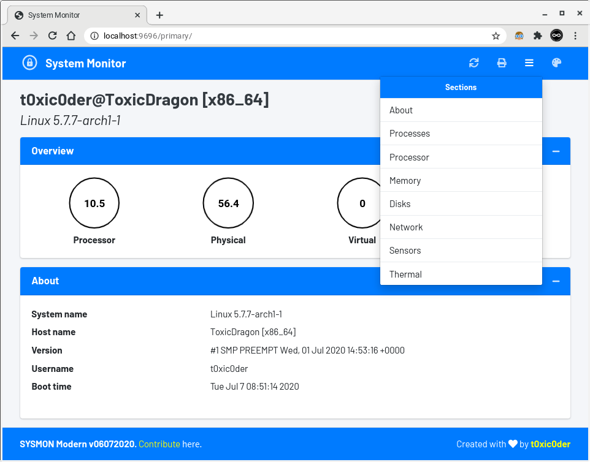
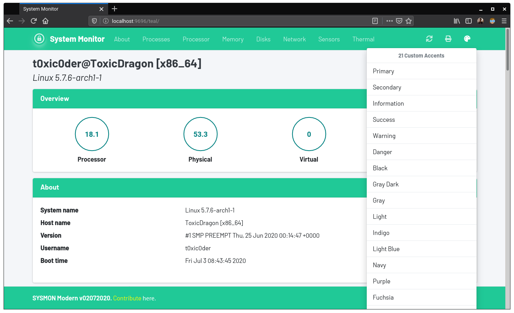
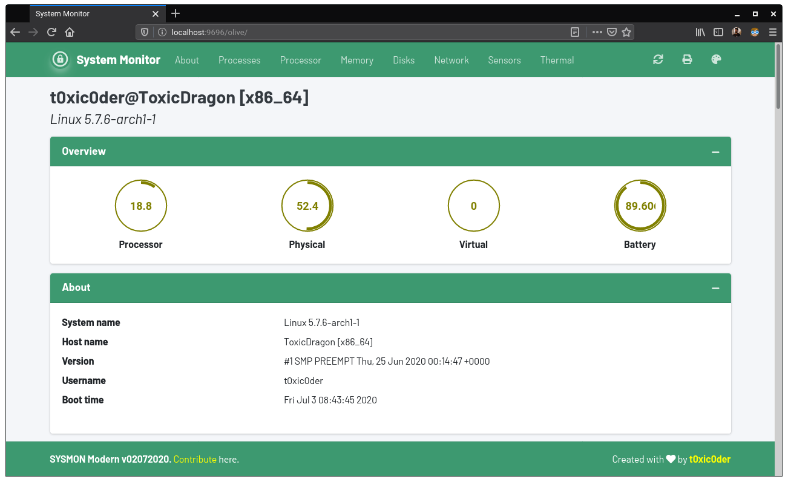
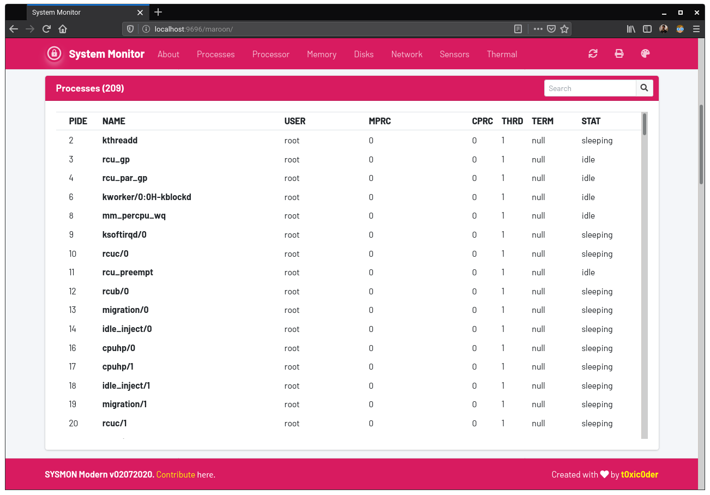
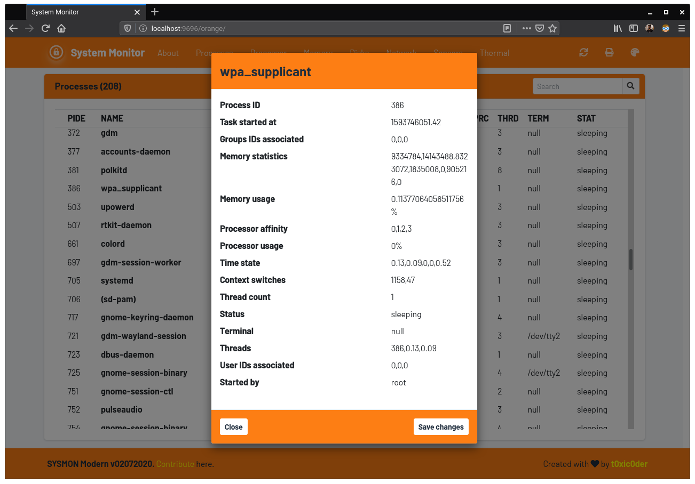
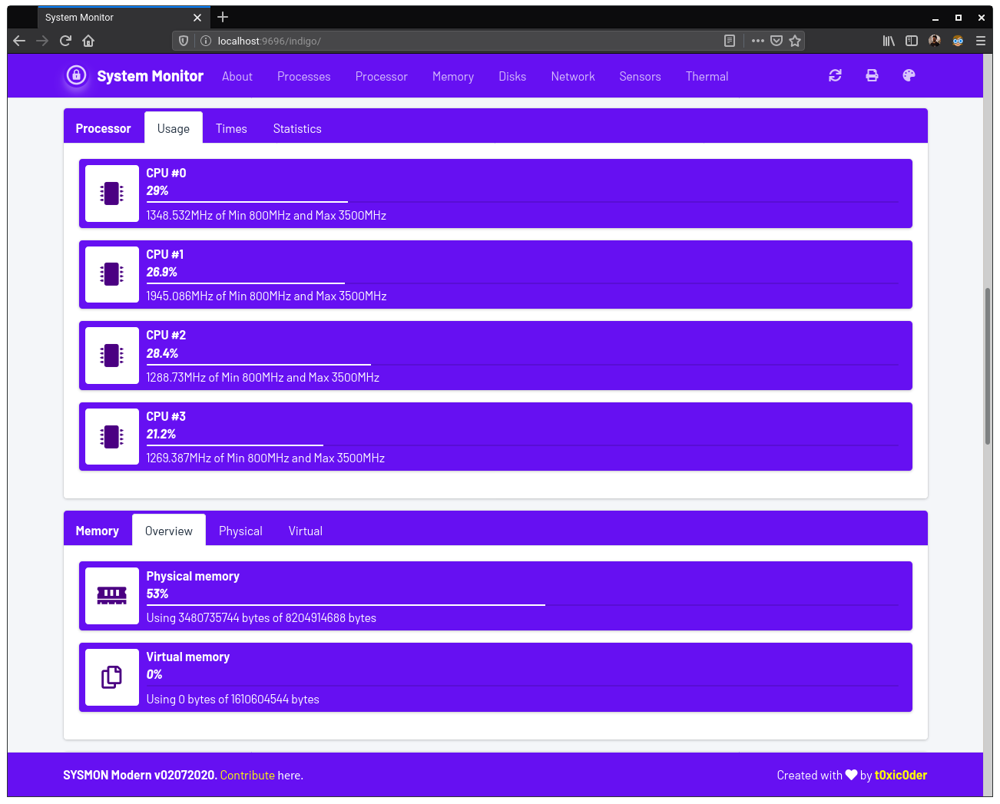
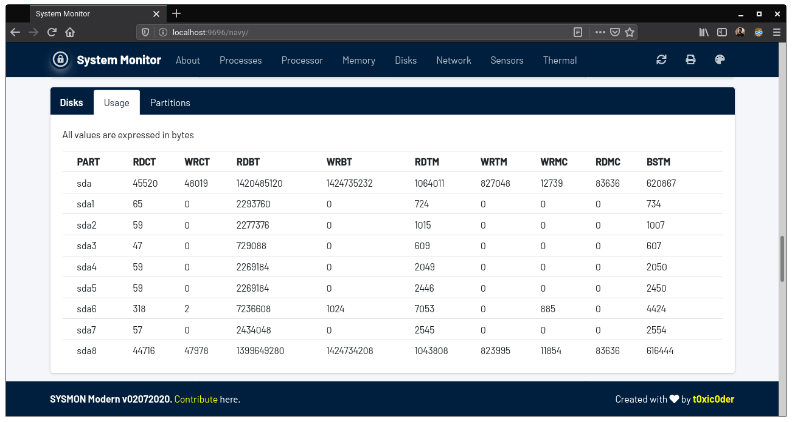
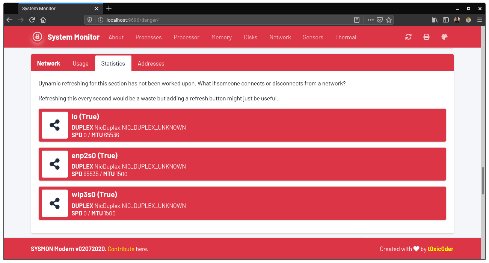
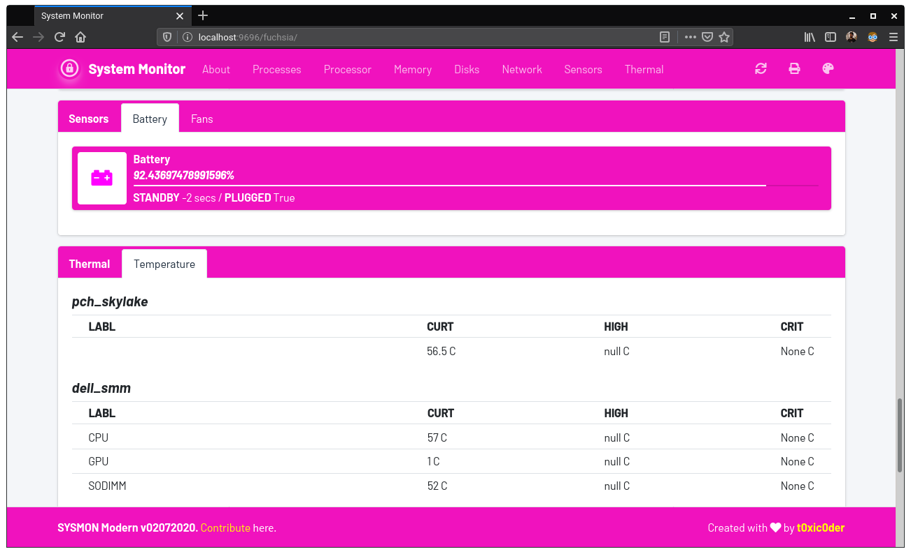

# sysmon
An intuitive remotely-accessible system performance monitoring and task management tool for servers

## Features
- Simplistic implementation of asynchronous periodic AJAX calls to fetch information
- Relatively low overhead from the server during stat (approx. 4MB over Python 3 runtime usage)
- Easy and flexible customization of interface by replacing the assets with your own
- Tweakable refresh times for dynamic information with endpoints powered by **`psutil`**
- Report printing and dynamic refreshing buttons available at disposal
- Hybrid cross-client theming engine built with upto 21 supported theming options
- Complex process management with per-task **`TERMINATE`**, **`KILL`**, **`SUSPEND`** and **`RESUME`** operations

## Using the **`sysmon`** binary
- Download the latest binary from the [**releases**](https://github.com/t0xic0der/sysmon/releases) page.
- Make the binary **executable** by running `sudo chmod +x WebStationSYSMON`.
- **Execute** the binary with `./WebStationSYSMON -p 6969 -6`. This runs the webserver at port 6969 and is accessible via all IPv4 and IPv6 addresses.
- **Tweak** the binary to run it with the options of your liking.
```shell script
Options:
  -p, --portdata TEXT  Set the port value [0-65536]
  -6, --ipprotv6       Start the server on an IPv6 address
  -4, --ipprotv4       Start the server on an IPv4 address
  --version            Show the version and exit.
  --help               Show this message and exit.
```
- Open up a browser in a device reachable to your PC and visit `http://<IP-ADDRESS>:<PORT-NUMBER>/primary` to get started.
- When done tinkering, **shut down** the SYSMON server by pressing `[Ctrl+C]`.
- Give stars to the repository if it was helpful.

## Enabling **`sysmon`** as a `systemd` service
- Download the latest binary from the [**releases**](https://github.com/t0xic0der/sysmon/releases) page.
- Execute `sudo nano /etc/systemd/system/WebStationSYSMON.service` and add the following lines.
```shell script
[Unit]
After=network.target

[Service]
ExecStart=/usr/local/bin/WebStationSYSMON -p 6969 -6

[Install]
WantedBy=default.target
```
The above example is a `systemd` service for the binary which would execute it on boot on port number **6969** and would be accessible to both IPv4 and IPv6 addresses.
- The following options are available for **tweaking** as per your choice.
```shell script
Options:
  -p, --portdata TEXT  Set the port value [0-65536]
  -6, --ipprotv6       Start the server on an IPv6 address
  -4, --ipprotv4       Start the server on an IPv4 address
  --version            Show the version and exit.
  --help               Show this message and exit.
```
- Copy the downloaded `WebStationSYSMON` file to `/usr/local/bin/` directory.
- Make the binary **executable** by running `sudo chmod 744 /usr/local/bin/disk-space-check.sh`.
- Make the `systemd` service file **executable** by running `sudo chmod 664 /etc/systemd/system/WebStationSYSMON.service`.
- **Reload** new `systemd` service configuration files by running `sudo systemctl daemon-reload`.
- **Enable** the newly created service by running `sudo systemctl enable WebStationSYSMON.service`.
- To **test** the script before a reboot, execute `sudo systemctl start WebStationSYSMON.service`.
- Check the service **status** by running `sudo systemctl status WebStationSYSMON.service`.
- Open up a browser in a device reachable to your PC and visit `http://<IP-ADDRESS>:<PORT-NUMBER>/primary` to get started.
- To **stop** the service, execute `sudo systemctl stop WebStationSYSMON.service` - It will start again on boot.
- To **disable** the service, execute `sudo systemctl disable WebStationSYSMON.service` - It will need **enabling** to work.
- Give stars to the repository if it was helpful.

## Screenshots

### Section Picker [Primary]


### Cool 21 Theming Options [Secondary]


### Overview and About Section [Olive]


### Process Listing [Success]


### Task Management Modal [Information]


### Processor and Memory Overview [Warning]


### Disk Usages Overview [Navy]


### Network Statistics Overview [Fuchsia]


### Sensors and Thermal Overview [Maroon]


## Using the script
1.  Install and upgrade virtualenv if not already done by executing `pip3 install virtualenv --user`.
2.  Clone the repository on your local drive and make it your current working directory.
3.  Create a virtual environment by executing `virtualenv venv`.
4.  Activate the virtual environment by executing `source venv/bin/activate`.
5.  Install all dependencies for the project by executing `pip3 install -r requirements.txt`.
6.  Run the project server by executing `python3 main.py`.
7.  Take a note of the computer's IP address and make sure that it is reachable.
8.  Visit `http://<YOUR-IP-ADDRESS>:9696/primary` from the other device (or `http://localhost:9696/primary` on the same PC).
9.  Take a look at the different themes available, refresh the monitor or print reports when needed.
10. Select processes to open up modals - `TERMINATE`, `KILL`, `SUSPEND` and `RESUME` processes at will.
11. When done tinkering, deactivate the virtual environment by executing `deactivate`.
12. Give stars to the repository if it was helpful.

## To-do
- [X] Write driver code and endpoint access code for **Processor** page
- [X] Write client-side Jinja template and AJAX calls for **Processor** information
- [X] Write driver code and endpoint access code for **Memory** page
- [X] Write client-side Jinja template and AJAX calls for **Memory** information
- [X] Write driver code and endpoint access code for **Disks** page
- [X] Write client-side Jinja template and AJAX calls for **Disks** information
- [X] Write driver code and endpoint access code for **Network** page
- [X] Write client-side Jinja template and AJAX calls for **Network** information
- [X] Write driver code and endpoint access code for **Sensors** page
- [X] Write client-side Jinja template and AJAX calls for **Sensors** information
- [X] Write driver code and endpoint access code for **About** page
- [X] Write client-side Jinja template and AJAX calls for **About** information
- [X] Write driver code and endpoint access code for **Thermal** page
- [X] Write client-side Jinja template and AJAX calls for **Thermal** information
- [X] Write driver code and endpoint access code for **Processes** page
- [X] Write client-side Jinja template and AJAX calls for **Processes** information
- [ ] Implement process search feature using the search bar (For now, it is just a placeholder)
- [X] Add capacity to **TERMINATE/KILL/SUSPEND/RESUME** etc. tasks from the modal
- [ ] Highlight useful information in a much less granular manner
- [ ] Add data visualization with line graph, bar graph and donut charts
- [X] Cleanup asynchronous calls and optimize them for speedup
- [ ] Add element in the frontend to help modify refresh rate from the frontend
- [X] Cleanup decorators in backend and optimize them for efficiency
- [ ] Add a documentation about theming guidelines
- [X] Add client-side theming option using Javascript, unretained across sessions
- [X] Add JQuery dependencies to be loaded up from local storage
- [X] Add custom font dependencies to be loaded up from local storage
- [X] Minimize CSS/JS dependencies and remove those which are unused
- [ ] Add monotype fonts for numeric values
- [ ] AJAX calls should replace the value of a `<span>` element only
- [X] Include functionality of server-side theming using Jinja
- [X] Clean up fetches which require creation and population separately
- [X] Limit endpoints to ONE by dispersing all information from single endpoint
- [ ] Include JSON (or YAML) based customizations for enabling/disabling sections
- [X] Add a PRINT document button at the top-right corner of the UI
- [X] Prevent text-selection/drag-drop capabilities in the UI
- [ ] Make a `document.location.href` for external links and ensure opening in new tab
- [X] Add dynamic refreshing functionality to disk partitions and network interfaces sect
- [ ] Fix responsiveness in cards for disk partition listing
- [ ] Trim numerical information to have much lesser accuracy
- [ ] Correct tabinations and code sanity in the client-side code
- [ ] Add functionality to switch the units for thermal data between celsius and fahrenheit
- [ ] Add an obligatory dark mode feature (for everybody else has it now)
- [ ] Change `onclick` highlighting color on dropdown menus (It is by-default `primary` for all accents)
- [X] Package it in a binary file with [`click`](https://click.palletsprojects.com/en/7.x/) to set command-line options
- [X] Make the binary (along with command-line options) usable as a `systemd` service
- [ ] Add user login feature as with complex process management, control cannot be left open
- [X] `[Would not be implemented as it breaks tab-switching feature]` Replace all card tabs `anchors` with `document.location.href` attributes
- [ ] Replace all `getElementById` with JQuery methods for speed up
- [ ] Hide resume button for processes already running and show resume for only `STOPPED` tasks
- [ ] Add tooltips for the task management buttons
- [ ] Add documentation about the various attributes and columns in table in another tab (per card)
- [X] Make the server be visible across the internet using IPv6 addresses
- [ ] Add driver function in a class format per section of details/actions

## Bugs
- **Modern UI**
    - May require hard refreshing (**`Ctrl+Shift+R`**) followed by a normal refresh (**`Ctrl+R`**) to get proper data in knob
    - Responsiveness is broken in cases where the line follows on to be too long without spaces
    - CSS colors specified by the boilerplate do not match with the one specified in the standard
    - The process modal does not refresh - data shown in the modal is at taken at the time of opening
    - Multiple data elements are expressed in uncannily long, bigger and unnecessary accuracies
    - Minor slow downs are expected as all data elements are fetched and refreshed separately
    - Section references scroll up and inconveniently hide behind the persistent top bar
    - Requires a short wait before the task management modal can be of use for the same process
    - Some information overflow out of the task management modal - Wrap must be implemented
    - Multiple calls made per second by the JavaScript engine can cause slow down in some browsers
    - Network statistics and addresses are not actively refreshed. What if someone disconnects or reconnects?
    - Disk partition details are not actively refreshed. What if someone pulls out or pushes in a drive?
    - Scrollbar disappears in Chrome (intended behaviour) while not so on Firefox (unintended behaviour)

## Helpful
1. https://stackoverflow.com/questions/15721679/update-and-render-a-value-from-flask-periodically
2. https://stackoverflow.com/questions/32149892/flask-application-built-using-pyinstaller-not-rendering-index-html

## Contribute
The project is currently in diverse development process. The codebase needs cleanup, optimization and documentation so one may find it hard to get their hands into it. Feel free to contact me at akashdeep.dhar@gmail.com if you wish to contribute.
